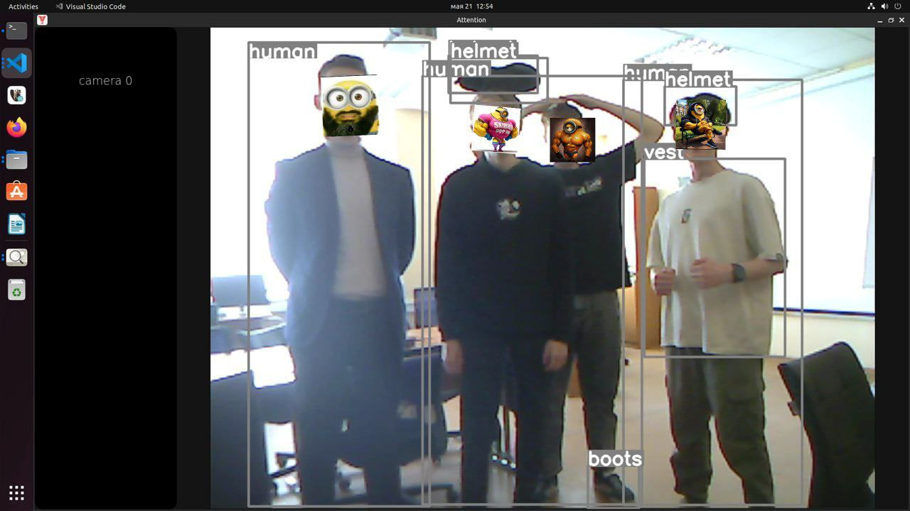
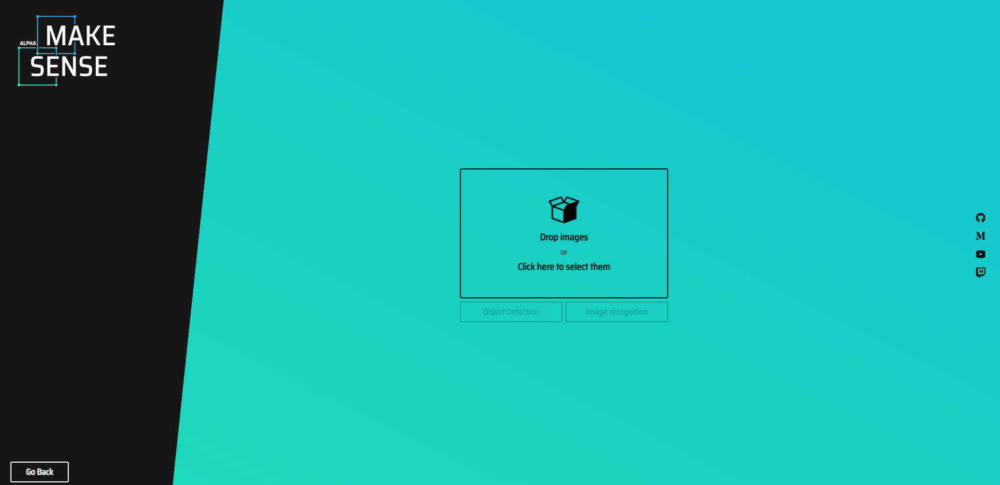
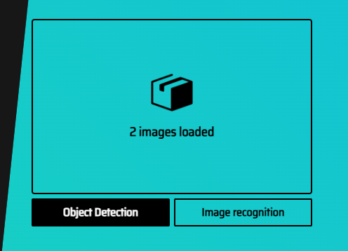
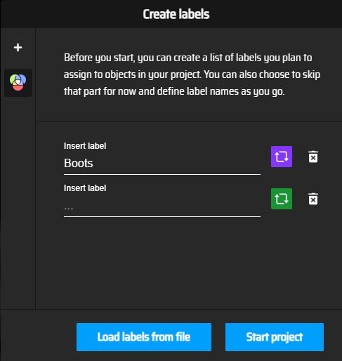
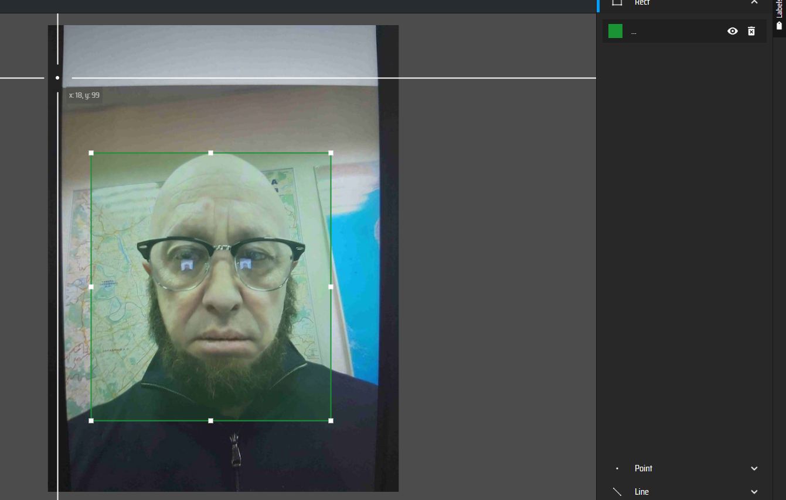
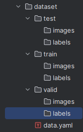
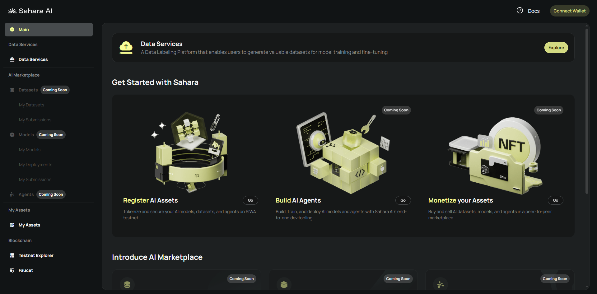
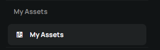
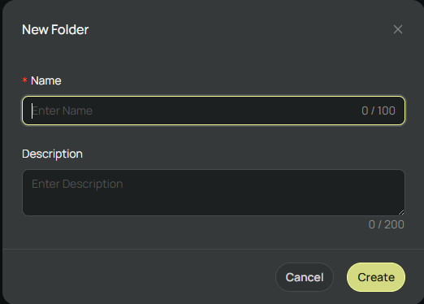
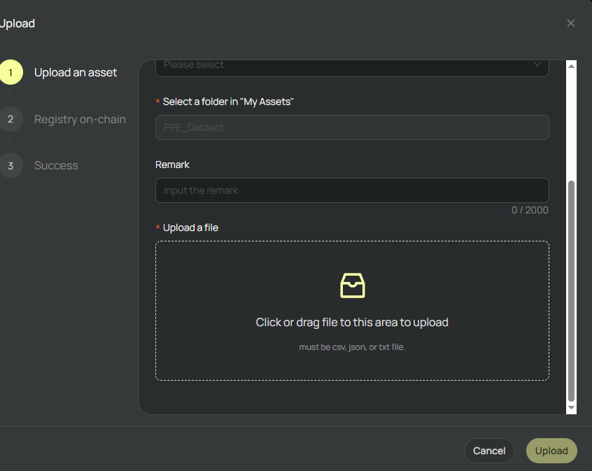

# Creating a Dataset for SaharaAI
Hello, dear reader!
Today, I’ll tell you how my team and I put together a dataset for a competition hosted by a major IT company. At the end of the article, we’ll upload this dataset to the SaharaAI platform together.

## About Sahara AI


Sahara AI is a project that combines AI and blockchain.
On their website, they state:
Built for AI developers, open to everyone.
A platform where anyone can create and monetize AI models, datasets, and applications in a collaborative space, powered by the Sahara blockchain.
Sahara AI also has a large number of partners and investors—for example, Microsoft has shown interest in the project. 

I decided to publish my dataset there because I’m a supporter of decentralization in the IT industry.

## Introduction



About a year ago, four of my college friends and I decided to participate in a competition hosted by a major IT company.
The task was to create a neural network capable of detecting personal protective equipment (PPE) in images.

In the field of information technology, this is a fairly trivial problem—it’s been solved for a long time and in many different ways.
But solving it with a ready-made dataset from the internet was, of course, not interesting for us, so we decided to gather our own :)

## 1. Data Collection

The goal was to collect "a lot" of images because even 10,000 might not be enough for a high-quality model.

But how do we do that?
Our team consisted of only five people, and time was very limited—besides the model, we still had to develop an app and prepare a polished presentation.

So, guided by the idea of "the more, the better" and after some thought, I decided that the most rational approach would be to gather open datasets from the internet and add around 10,000 of our own images.

### 1.1 Collecting Ready-Made Datasets


For finding ready-made datasets, I recommend using Roboflow or Kaggle—they have plenty of datasets for object detection.

### 1.2 Collecting Data from YouTube Videos

This step is much more interesting :)
First, I downloaded several videos from construction sites and industrial facilities.
Finding suitable ones wasn’t easy—the footage had to clearly show helmets and other PPE.

#### 1.2.1 Splitting Videos into Frames

Now that we’ve downloaded the necessary videos, we need to split them into individual images.
For your convenience, I’ve published a Python library I wrote for processing YOLO datasets.

First, let’s install it.

```bash
pip install yolo-dataset-redactor
```

Now, using this library, we’ll split the downloaded videos into frames.

```python
from yolo_dataset_redactor.video import Videos # Import the Videos class

videos_path = "./videos" # Folder containing the videos
images_path = "./images" # Folder where frames will be saved
period = 50 # Take every 50th frame from the video

videos = Videos(videos_path) # Create the class
videos.split(images_path, period) # Split all videos into frames
```

#### 1.2.2 Resizing Images

For proper model training, all images must have the same resolution.
Let’s write a small script for this.

```python
from yolo_dataset_redactor.image import Images # Import the Images class

images_path = "./images" # Folder containing the images
new_size = (640, 640) # Resize to 640x640
image_suffixes = ["png"] # File extensions for images

images = Images(images_path, image_suffixes) # Create the class
images.resize(new_size) # Resize all images
```

#### 1.2.3 Labeling the Images

This is the most tedious part of the task. We had about 10,000 unlabeled images, and for YOLO to learn, bounding boxes had to be marked on each one.
My team and I decided to do this on https://www.makesense.ai/.
First, we uploaded all the images to the site.
<br>
Selected Object Detection<br>
<br>
Added the necessary classes<br>
<br>
And labeled each image<br>
<br>
## 1.3 Merging the Data
## 1.3.1 Creating the Structure
Now that our data is labeled, we’ll merge it with other downloaded datasets.
To do this, we create a YOLO dataset structure in the file explorer.
It should look like this:<br>
<br>


## 1.3.2 Configuring data.yaml
The data.yaml file helps YOLO understand where the data is stored and what the classes are.
```yaml
train: ../train/images # Training dataset
val: ../valid/images # Validation dataset
test: ../test/images # Testing dataset

nc: 5 # Number of classes
names: ['Boots', 'Gloves', 'Helmet', 'Human', 'Vest'] # Class names (order matters, as it determines the ID in the file)
```

## 1.3.3 Uploading Files to the Structure
With data.yaml and the structure ready, we’ll load the data from other datasets and our own.
From our dataset, I moved all images into the train dataset. The other datasets were distributed into their respective folders (i.e., from train to train, from test to test, etc.).

# Step 2. Uploading to Sahara AI
Go to https://app.saharalabs.ai/developer-platform/ and connect your wallet.
<br>
<br>
Click MyAssets in the bottom-left corner.<br>
<br>
Create a new folder (you can name it whatever you like)<br>
<br>
And upload the dataset.<br>
<br>
### Consider this entire Step 2 a small guide unrelated to the main topic. My apologies—I didn’t realize that image datasets couldn’t be uploaded and started writing the article before figuring that out.
