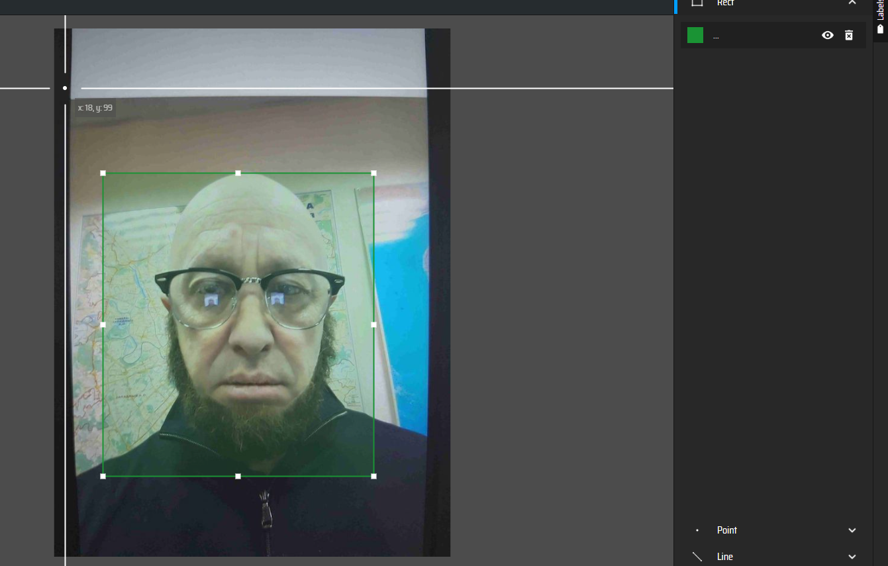

# Создание набора данных для SaharaAi

<style>
    img{ 
        border-radius: 5px;
    }
</style>

Привет, дорогой читатель!
Сегодня расскажу, как я со своей командой собирал дата сет для конкурса от крупной IT компании. В конце статьи мы вместе загрузим этот датасет на платформу SaharaAI.

## О Sahara AI

<br>
Sahara AI — проект, объединяющий ИИ и блокчейн.
На своём сайте они пишут:
Создана для разработчиков ИИ, открыта для всех.
Платформа, где каждый может создавать и монетизировать модели ИИ, наборы данных и приложения в совместном пространстве,
построенная на блокчейне Sahara.
Также у Sahara AI большое количество партнёров и инвесторов, например, Microsoft заинтересована в
проекте. <br>
Я решил выложить свой дата сет именно туда, так как являюсь сторонником децентрализации в IT сфере.

## Введение

<br>
Примерно год назад я с четырьмя друзьями из колледжа решил поучаствовать в конкурсе от крупной IT компании.
Задание — создать нейросеть, которая будет обнаруживать средства индивидуальной защиты на изображении. <br>
В сфере информационных технологий это довольно тривиальная задача, она решается давно и множеством разных способов.
Но решать её с готовым дата сетом из интернета нам, конечно же, было неинтересно, поэтому мы решили собрать свой
собственный :)

## 1 Сбор данных

Цель — собрать «очень много» изображений, ведь для хорошего качества модели даже 10 000 может быть недостаточно. <br>
Но как это сделать?
Команда у нас всего пять человек, и времени очень мало: кроме модели нужно успеть сделать приложение и красивую
презентацию. <br>
Поэтому я, руководствуясь идеей «чем больше, тем лучше» и немного подумав, решил, что рациональнее всего собрать
открытые дата сеты из интернета
и добавить около 10 000 своих собственных изображений.

### 1.1 Сбор готовых наборов данных

<br>
Для поиска готовых наборов данных советую использовать Roboflow или Kaggle — на них очень много дата сетов для детекции.

### 1.2 Сбор данных с видео на YouTube

Этот этап уже гораздо интереснее :)
Первым делом я скачал несколько видео со строек и предприятий.
Искать подходящие было не так уж просто — нужно было, чтобы на кадрах чётко было видно каски и другие СИЗ. <br>

#### 1.2.1 Разделение видео на фреймы

Теперь, когда мы скачали нужные видео, надо разделить их на отдельные изображения.
Для вашего удобства я выложил библиотеку на языке Python, которую писал для обработки yolo дата сетов. <br>
Первым делом скачаем её.

```bash
pip install yolo-dataset-redactor
```

Теперь с её помощью разделим скачанные видео на фреймы.

```python
from yolo_dataset_redactor.video import Videos  # импортируем класс Videos

videos_path = "./videos"  # папка где лежат видео
images_path = "./images"  # папка куда сохраняются кадры
period = 50  # берём каждый 50 кадр из видео

videos = Videos(videos_path)  # создаём класс
videos.split(images_path, period)  # разделяем все видео на фреймы
```

#### 1.2.2 Изменение разрешений изображений

Для корректной обучения модели все изображения должны быть одного разрешения.
Для этого напишем небольшой скрипт.

```python
from yolo_dataset_redactor.image import Images  # импортируем класс Images

images_path = "./images"  # папка где лежит изображения-
new_size = (640, 640)  # изменяем разрешения на 640 на 640 
image_suffixes = ["png"]  # расширения файлов с изображением

images = Images(images_path, image_suffixes)  # создаём класс
images.resize(new_size)  # разделяем все видео на фреймы
```

#### 1.2.3 Разметка изображений

Это самая тягомотная часть задачи. У нас было примерно 10 тысяч неразмеченных изображений, для того что бы yolo могла обучиться, на каждом из них нужно отметить боксы.
Мы с командой решили делать это на сайте https://www.makesense.ai/.
Загружаем все изображения на сайт.
<br>
Выбираем Object Detection<br>
<br>
Добавляем нужные классы<br>
<br>
И размечаем каждое изображение<br>
<br>

 ### 1.3 Объединение данных
#### 1.3.1 Создание структуры
Теперь когда наши данные размечены объединим их с другими скачанными дата сетами.
Для этого создаём структуру yolo дата сета в проводнике.
Она должны выглядеть вот так:<br>

 
 #### 1.3.2 Настройка data.yaml
 data.yaml - файл с помощью которого yolo поймёт, где лежат данные и какие у них классы.
 ```yaml
train: ../train/images # тренировочный дата сет
val: ../valid/images # валидационный дата сет
test: ../test/images # дата сет для тестирования

nc: 5 # количество классов
names: ['Boots', 'Gloves', 'Helmet', 'Human', 'Vest'] # имена классов (порядок важен, так как от него зависит id в файле)
```

#### 1.3.3 Загрузка файлов в структуру
data.yaml и структура готова, поэтому загрузим данные из других дата сетов и нашего.
Из своего я закинул все изображения в train дата сет. Остальные наборы данных раскидываем в те же папки, в которых они лежали (тоесть из train в train, из test в test и т.д.).

## Этап 2. Загрузка на Sahara AI
Заходим на сайт https://app.saharalabs.ai/developer-platform/ и подключаем кошелёк.

Нажимаем MyAssets слева снизу.<br>
<br>
Создаём новую папку (Назвать можете как захотите)<br>
<br>
И загружаем дата сет.<br>
<br>
Считайте весь этап 2 маленьким пособием не относящимся к основному. Прошу прощения, так как не заметил, что нельзя добавлять дата сеты с изображениями и начала писать статью раньше чем понял это.